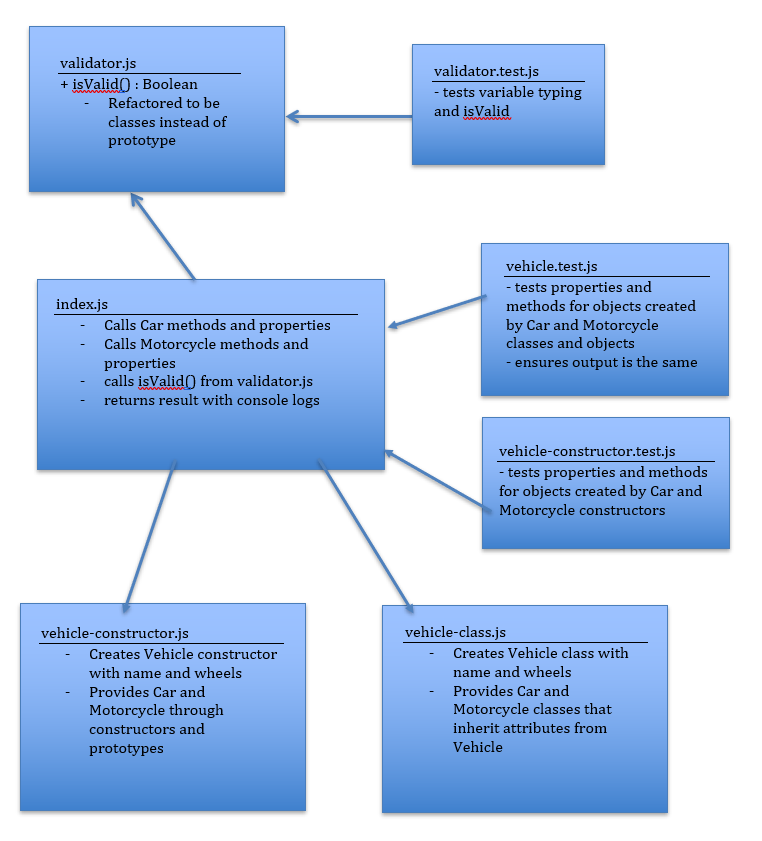

# LAB - Classes, Inheritance, Functional Programming (02)

## More TDD Plus Classes

### Author: Earl Jay Caoile

### Links and Resources
* [submission PR](https://github.com/js-401n15-eoc/lab-02/pull/1)
* [GitHub Actions](https://github.com/js-401n15-eoc/lab-02/actions)

#### Documentation
* [MDN docs (Classes)](https://developer.mozilla.org/en-US/docs/Web/JavaScript/Reference/Classes)

### Setup
#### Tests
* Testing command: `npm test` (from classes directory) or `cd classes && npm test` from root directory

#### UML
